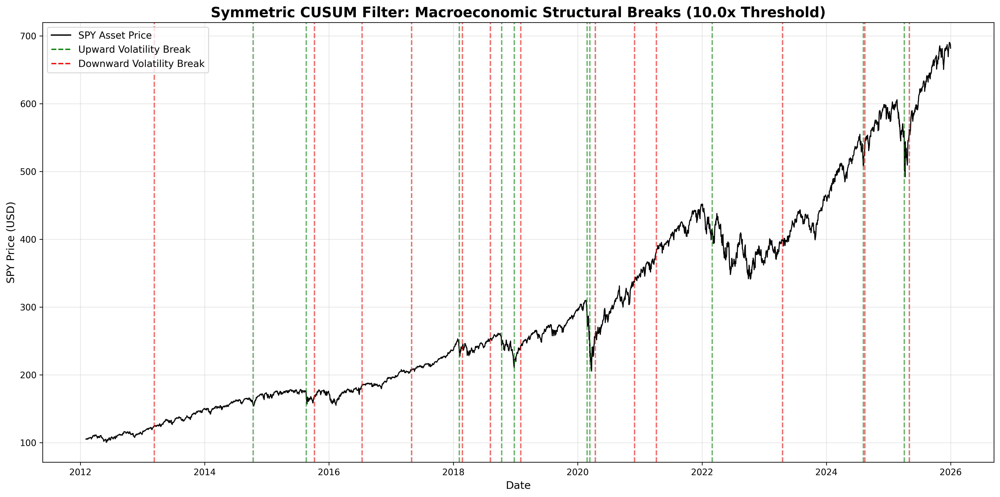

# Market Regime Detection System

## Executive Summary
This project is a modular, mathematically rigorous Market Regime Detection System. It is designed to act as an automated risk-management overlay—a "kill switch"—for algorithmic trading strategies. By identifying latent volatility states and acute macroeconomic structural breaks, the system dynamically shifts a portfolio to cash during periods of severe market microstructure fracture. 

This module serves as the foundational risk layer for a downstream Cointegration-based Statistical Arbitrage engine operating on Dollar Imbalance Bars.

## Mathematical Framework
The detection system evaluates financial time series through four distinct quantitative lenses, allowing for rigorous A/B testing of continuous-state versus sparse-event architectures:

1. **Distance-Based Clustering (K-Means):** Serves as a baseline to demonstrate the limitations of spherical clustering on leptokurtic financial data.
2. **Density-Based Clustering (Gaussian Mixture Models - GMM):** Utilizes the Expectation-Maximization algorithm with full covariance matrices to map the elliptical, fat-tailed nature of market returns.
3. **Temporal State Detection (Hidden Markov Models - HMM):** Applies the Baum-Welch algorithm to estimate hidden state transition probabilities and sequence likelihoods.
4. **Event-Driven Structural Breaks (Symmetric CUSUM Filter):** Directly implements the continuous cumulative sum framework outlined by Marcos Lopez de Prado in *Advances in Financial Machine Learning*. It detects explosive, path-dependent volatility fractures independent of arbitrary calendar constraints.

## System Architecture
The codebase strictly adheres to object-oriented programming principles and polymorphism. The backtesting engine (`backtest.py`) allows for seamless swapping of mathematical engines (K-Means, GMM, HMM) within the `StateDrivenStrategy` without altering the underlying trade execution logic. 

To accommodate the sparse-event nature of the CUSUM filter, an independent `EventDrivenStrategy` implements a dynamic time-decay memory latch, proving that structural break detection requires a fundamentally different architectural approach than continuous-state modeling.

## Backtest Results & Risk Overlay Performance
The models were backtested against a baseline Moving Average Crossover strategy on the S&P 500 (SPY) over a 14-year dataset. 

While continuous-state models struggled with whipsaw during high-volatility upside rallies, the **Symmetric CUSUM Event-Driven Overlay** successfully isolated true macroeconomic crashes. It effectively halved the maximum drawdown of the benchmark while maintaining a highly competitive Sharpe Ratio.

| Strategy             | Final Wealth | Sharpe | Max Drawdown |
|----------------------|--------------|--------|--------------|
| Buy & Hold SPY       | $6.31        | 0.83   | -35.75%      |
| Baseline MA Cross    | $3.56        | 0.67   | -35.75%      |
| K-Means Overlay      | $1.93        | 0.60   | -22.60%      |
| GMM Overlay          | $1.91        | 0.57   | -19.83%      |
| HMM Overlay          | $1.88        | 0.56   | -19.83%      |
| **CUSUM Overlay** | **$3.14** | **0.80**| **-20.28%** |

## Future Integration
This system is strictly isolated as a dependency module. The next phase of development involves building a separate data ingestion pipeline to sample continuous market data into volume-normalized **Dollar Imbalance Bars**. The CUSUM structural break array generated by this repository will dictate the stationarity assumptions for the forthcoming Cointegration Statistical Arbitrage agent.
